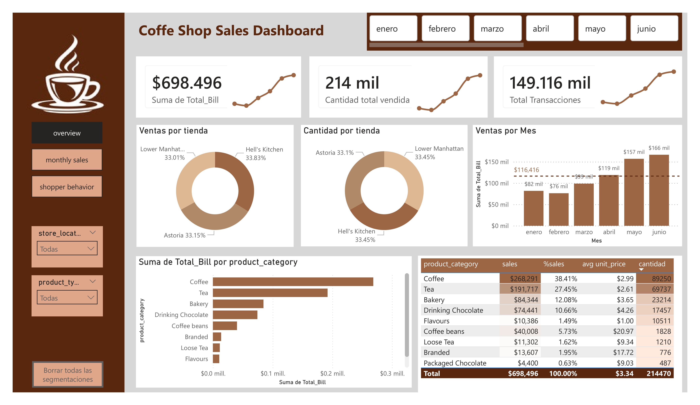
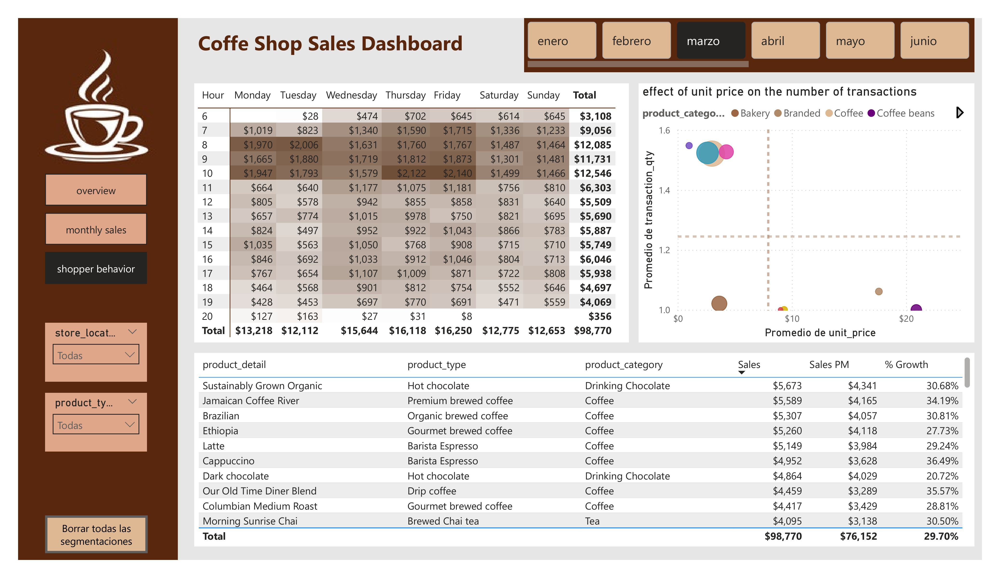

# ☕ Coffee Shop Sales: Multi-Stack Data Project


## 📌 Descripción del Proyecto

Este repositorio es un laboratorio de análisis de datos donde resuelvo los desafíos de negocio de una cafetería utilizando diferentes tecnologías. El objetivo es comparar la flexibilidad, el tiempo de desarrollo y la capacidad de visualización de cada herramienta.

El análisis se centra en tres pilares:

1. **Rendimiento de Ventas:** KPIs principales y comparativa mes a mes ($Sales PM$).
2. **Comportamiento del Consumidor:** Mapas de calor de horas pico.
3. **Optimización de Portafolio:** Matriz de precio vs. cantidad y crecimiento de productos.

---

## 🛠️ Tecnologías y Soluciones

### 1. Power BI (Completado)

Implementación de un dashboard interactivo de 3 páginas con lógica DAX avanzada.

* **Key Feature:** Inteligencia de tiempo manual sin tablas de calendario.
* **Visual destacado:** Heat Map de horas pico y Top/Bottom N dinámico.
* **Carpeta:** `/PowerBI-Dashboard`

### 2. Python - Streamlit/Dash (Próximamente)

Replicación de la lógica de negocio utilizando el stack de Data Science de Python.

* **Librerías:** Pandas para manipulación, Plotly/Altair para visualización.
* **Foco:** Automatización y despliegue rápido.
* **Carpeta:** `/Python-App`

---

## 📐 Lógica de Negocio (DAX Example)

Para mantener la consistencia entre tecnologías, se definió una lógica de "Mes Anterior" que respeta el contexto de producto:

```dax
Sales PM = 
VAR MesSeleccionado = SELECTEDVALUE('coffee_shop_sales'[Month])
VAR AnioSeleccionado = SELECTEDVALUE('coffee_shop_sales'[transaction_date].[Año])

RETURN
CALCULATE(
   SUM('coffee_shop_sales'[Total_Bill]), 
   ALLEXCEPT(
       'coffee_shop_sales', 
       'coffee_shop_sales'[product_detail], 
       'coffee_shop_sales'[product_type], 
       'coffee_shop_sales'[product_category]
   ),
   'coffee_shop_sales'[Month] = MesSeleccionado - 1,
   'coffee_shop_sales'[transaction_date].[Año] = AnioSeleccionado
)
```

---

## 📂 Estructura del Proyecto

```
├── Data/                 # Dataset original (CSV)
├── PowerBI-Dashboard/    # Archivo .pbix y Screenshots
├── Python-App/           # Scripts de Streamlit/Dash (En desarrollo)
├── .gitignore            # Configuración para ignorar archivos basura
└── README.md             # Documentación principal
```

---

## 📸 Capturas de Pantalla

| Stack   | Screenshots                                                   |                                                               |                                                               |
|:------- |:------------------------------------------------------------- | ------------------------------------------------------------- | ------------------------------------------------------------- |
| PowerBI |  |  |  |
|         |                                                               |                                                               |                                                               |

---

## ✒️ Autor

**Luis Carlos Pallares Ascanio** - [Tu LinkedIn](https://linkedin.com/in/lcpallares)